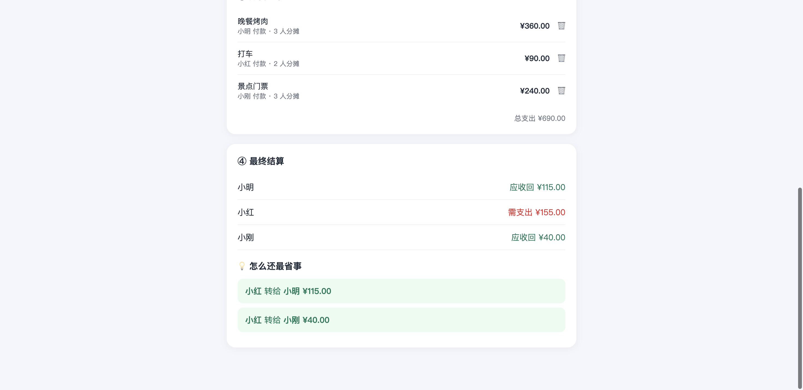

# 💸 费用分摊器 Expense Splitter

一起旅行、聚餐、合租时，记下「谁付了多少、由谁一起分摊」，自动算出最后**谁该还谁多少钱**，
并给出转账笔数最少的还款方案。纯前端、零依赖、双击即用，数据存在本地。

## ✨ 功能

- 👥 **添加成员**
- 🧾 **记录每笔支出**：花在哪、谁付的、多少钱、由谁分摊（可只选部分人）
- ⚖️ **自动结算**：算出每个人是「应收回」还是「需支出」
- 💡 **最省事还款方案**：用贪心算法合并债务，让转账次数尽量少
- 💾 自动保存，下次打开还在

## 🚀 使用

双击 `index.html` 打开。① 添加至少 2 个人 → ② 一笔笔记账 → ④ 底部自动显示结算结果。

## 🛠 技术说明（给好奇的你）

- 核心逻辑只有两步：
  1. 算出每个人的**净余额** = 他垫付的钱 − 他该分摊的钱（正数=别人欠他）。
  2. 把欠钱的人和该收钱的人**两两抵消**，得到最少的转账方案。
- 用 `Math.round(x*100)/100` 处理金额，避免小数点的浮点误差。
- 数据存在浏览器 `localStorage` 里，不联网、不上传。

## 📄 许可证

MIT
